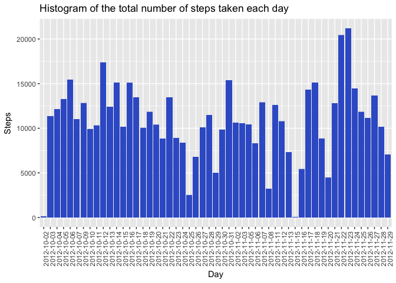
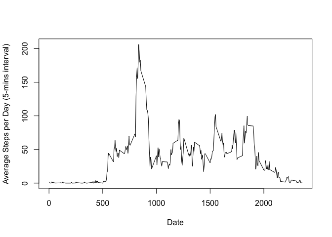

# Reproducible Research: Analyzing FitBit Data
Amir Hamzah Khalid  
 December, 2016  

###About
This was the first project for the **Reproducible Research** course in Coursera's Data Science specialization track. The purpose of the project was to answer a series of questions using data collected from a [FitBit](http://en.wikipedia.org/wiki/Fitbit).

##Synopsis
The purpose of this project was to practice:

* loading and preprocessing data
* imputing missing values
* interpreting data to answer research questions

## Data
The data for this assignment was downloaded from the course website:

* Dataset: [Activity monitoring data](https://d396qusza40orc.cloudfront.net/repdata%2Fdata%2Factivity.zip) [52K]

The variables included in this dataset are:

* **steps**: Number of steps taking in a 5-minute interval (missing
    values are coded as `NA`)

* **date**: The date on which the measurement was taken in YYYY-MM-DD
    format

* **interval**: Identifier for the 5-minute interval in which
    measurement was taken

The dataset is stored in a comma-separated-value (CSV) file and there are a total of 17,568 observations in this dataset.

## Loading and preprocessing the data
Download, unzip and load data into data frame `data`.


```r
# Clean up workspace
rm(list = ls(all = TRUE))

library(graphics)   # load R Graphic packages
library(grDevices)  # load R Graphic Devices and Support for Colours and Fonts
library(dplyr)
```

```
## 
## Attaching package: 'dplyr'
```

```
## The following objects are masked from 'package:stats':
## 
##     filter, lag
```

```
## The following objects are masked from 'package:base':
## 
##     intersect, setdiff, setequal, union
```

```r
# Set working directory
  setwd('~/Documents/Study/Data Science Specialization Course/5 Reproducible Research/Project1/')
  
# Create Data folder in working directory if not exist
  if(!file.exists("./data")) { dir.create("./data") }

# Downloading and reading in the dataset: 
  if(!file.exists("getdata-projectfiles-UCI HAR Dataset.zip")) {
    temp <- tempfile()
    download.file("https://d396qusza40orc.cloudfront.net/repdata%2Fdata%2Factivity.zip",temp)
    unzip(temp)
    unlink(temp)
  }
  activityRawData <- read.csv("activity.csv", stringsAsFactors = FALSE)
  dim(activityRawData)
```

```
## [1] 17568     3
```

```r
  # Code for preprocessing the data (Removing NAs):
  noNAActivityData <- activityRawData[complete.cases(activityRawData), ]
  dim(noNAActivityData)
```

```
## [1] 15264     3
```


## What is mean total number of steps taken per day?
Histogram of the total number of steps taken each day answer:


```r
library(ggplot2)    # load R package to Create Elegant Data Visulaisations Using the Grammar of Graphics
# Histogram of the total number of steps taken each day
  ggplot(noNAActivityData, aes(as.factor(date),steps)) + 
    geom_bar(fill="royalblue3", stat="identity") + 
    xlab("Day") + 
    ylab("Steps") + 
    ggtitle("Histogram of the total number of steps taken each day") + 
    theme(axis.text.x = element_text(angle = 90, hjust = 1))
```

<!-- -->

```r
# Mean number of steps taken each day
  meanFreq <- as.integer(mean(aggregate(steps~date, noNAActivityData, FUN = sum)$steps))
  meanFreq
```

```
## [1] 10766
```

```r
# Median number of steps taken each day
  medianFreq <- median(aggregate(steps~date, noNAActivityData, FUN = sum)$steps)
  medianFreq
```

```
## [1] 10765
```

## What is the average daily activity pattern?
The average daily activity pattern answer:

```r
# Average daily activity pattern?
  q2 <- noNAActivityData
  q2 <- aggregate(steps~interval, q2, FUN = mean)
  plot(q2$steps ~ q2$interval, 
       type = "l", 
       xlab = "Date", 
       ylab = "Average Steps per Day (5-mins interval)")
```

<!-- -->

```r
# Code to look for the maximum number of steps:
  maxSteps <- q2[q2$steps == max(q2$steps), ]
  q2 <- NULL
  maxSteps
```

```
##     interval    steps
## 104      835 206.1698
```
The 5-minute interval 835, on average across all the days in the dataset, contains the maximum number of steps (206.1698113).

## Imputing missing values
Imputing missing values answer:
Code to calculate the total number of missing values in the dataset.

```r
  # Calculate the total number of missing values in the dataset
  numNA <- nrow(activityRawData) - nrow(noNAActivityData)
  numNA
```

```
## [1] 2304
```

```r
# Used the average steps taken for that specific interval in all of the data set and assign it to the missing value(s)
  imputedData <- activityRawData
  #The mean for that 5-minute interval
  meanForNA <- aggregate(steps~interval,imputedData, FUN = mean)
  for(i in 1:nrow(imputedData)){
    if(is.na(imputedData[i,c("steps")])){
      imputedData[i,c("steps")] <- meanForNA[meanForNA$interval == imputedData[i,c("interval")], c("steps")]
    }
  }
  
# Code to Show Histogram of the total number of steps taken each day after missing values are imputed.
  ggplot(imputedData,aes(as.factor(date),steps)) + 
    geom_bar(fill="royalblue3", stat="identity") + 
    xlab("Day") + 
    ylab("Steps") + 
    ggtitle("Histogram of the Total Number of Steps Taken Each Day (Imputed Data)") + 
    theme(axis.text.x = element_text(angle = 90, hjust = 1))
```

<!-- -->

```r
# New mean of the imputed data
  newmeanFreq <- as.integer(mean(aggregate(steps~date,imputedData, FUN = sum)$steps))
  newmeanFreq
```

```
## [1] 10766
```

```r
# New median of the imputed data  
  newmedianFreq <- as.integer(median(aggregate(steps~date,imputedData, FUN = sum)$steps))
  newmeanFreq
```

```
## [1] 10766
```
The new mean of the imputed data is 10766 steps compared to the old mean of 10766 steps. 
That creates a difference of 0 steps on `average per day`.

The new median of the imputed data is 10766 steps compared to the old median of 10765 steps. 
That creates a difference of 1 steps for the `median`.

This shows that the overall shape of the distribution has not changed after applying the method in imputing the data.


## Are there differences in activity patterns between weekdays and weekends?
